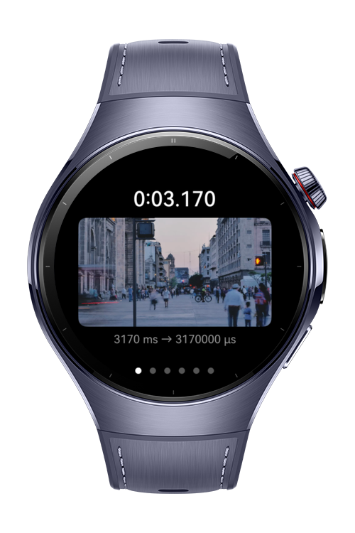
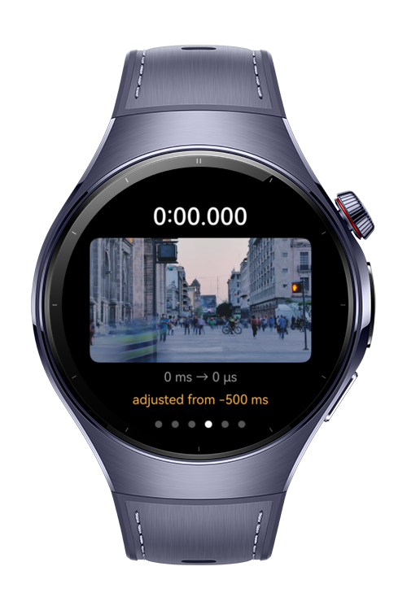
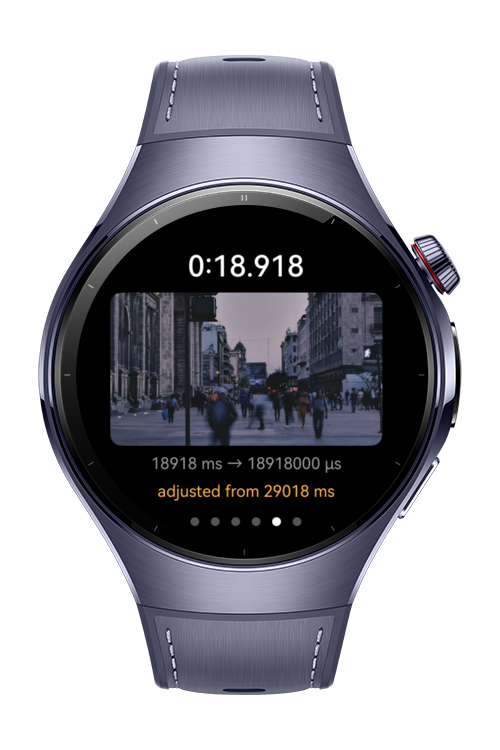

> **Note:** To access all shared projects, get information about environment setup, and view other guides, please visit [Explore-In-HMOS-Wearable Index](https://github.com/Explore-In-HMOS-Wearable/hmos-index).

# How to Convert MediaKit Units

In Media Kit different functions use different units for duration. This may create confusion among developers while inspecting or developing the code. This codelab demonstrates the unit conversion logic between AVMetadataExtractor which uses milliseconds and AVImageGenerator which uses microseconds. A custom MediaTime class provides msToUs and usToMs functions to handle time conversions.

# Preview

<div>
  
  
  
  
</div>

# Use Cases

- **Extract a single frame from a video** — Extract a single image that shows a single frame inside a video based on a given timestamp.
- **Convert the time under a single class** — Convert between milliseconds and microseconds with MediaTime class.
- **Clamp durations to avoid errors** — For the durations that are not in a valid interval, use clamp to get correct timestamp and extract the frame.

# Tech Stack

- **Languages:** ArkTS
- **Frameworks:** HarmonyOS SDK, API version 6.0.1(21)+
- **Tools:** DevEco Studio 6.0.1 or later
- **Libraries & Kits:**
    - `@kit.ArkUI`
    - `@kit.PerformanceAnalysisKit`
    - `@kit.MediaKit`
    - `@kit.AbilityKit`
    - `@kit.LocalizationKit`

# Directory Structure

```
how-to-build-ability-start/
└── entry/
    ├── build-profile.json5
    └── src/main/
        ├── module.json5
        ├── ets/
        │   ├── entryability/
        │   │   └── EntryAbility.ets           # Default lifecycle management class for module
        │   ├── entrybackupability/
        │   │   └── EntryBackupAbility.ets     # Default backup extension ability
        │   ├── common/
        │   │   └── VideoFrameExtractor.ets    # Handling the logic behind the time conversion and frame extractions
        │   └── pages/
        │       └── ThumbnailStripPage.ets     # Main display page that has swiper that shows the extracted frames
        └── resources/rawfile/
            └── sample.mp4                     # Exmaple file that will has the video for frame extraction.
     
```

# Constraints and Restrictions

- If you want to use this example as it is, you need to provide a video under resources/rawfile. Otherwise frame extraction will fail due to loading unavailable content. You can provide your own video and change the name of the file inside `ThumbnailStripPage.ets`. A parameter named `VIDEO_FILE` is available for this purpose.

# License

**How to Convert MediaKit Units** is distributed under the terms of the MIT License.
See the [LICENSE](./LICENSE) for more information.